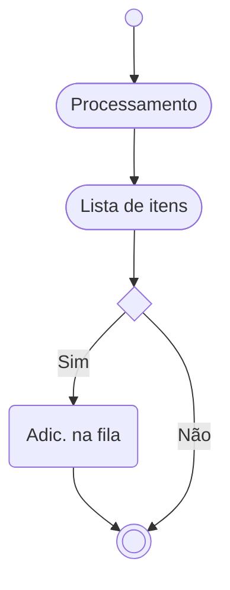

# Queue process
 Processamento de filas SMQ2.

 

> 🗘 Este documento, assim como o negócio, está em constante fase de melhoria e adaptação.

### Glossário

| Sigla | Significado | Descrição |
| :--- |:---------- |:---------- |
| BC|Business Consulting | ~~Find Clarity in Chaos~~ ABAP, Desenvolvedor SAP, Consultor ABAP, SAP DEV|

### Fluxo da solução

## Pontos de atenção 📝

- A chamada da função deve ser `IN BACKGROUND TASK DESTINATION 'NONE' AS SEPARATE UNIT`
- 
