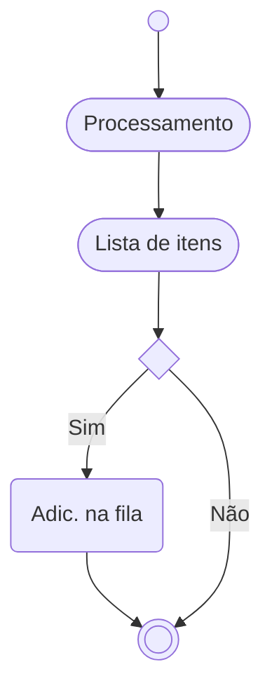
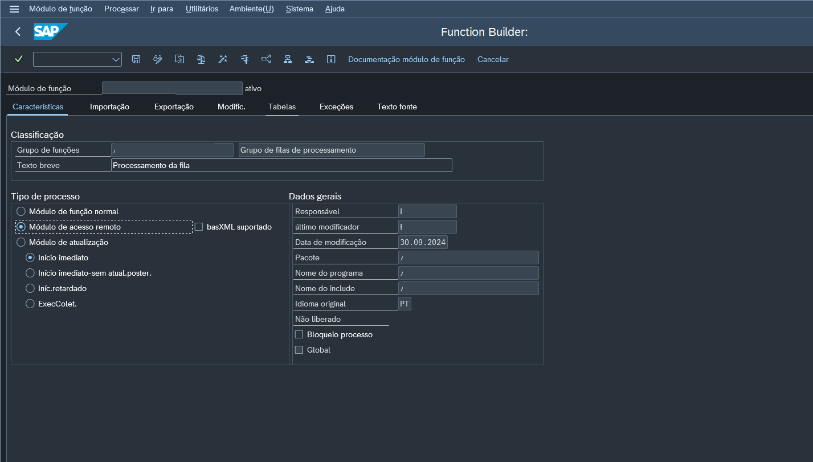

# Queue process
 Processamento de filas SMQ2.

 ~~No momento, eu penso que seja uma boa ideia fazer disso um post no SAP Blogs, mas essa animação vai por água abaixo em alguns dias~~
 


> 🗘 Este documento, assim como o negócio, está em constante fase de melhoria e adaptação.


## Glossário

| Sigla | Significado | Descrição |
|-----|-----------|------------|
| BC |Business Consulting | ~~Find Clarity in Chaos~~ ABAP, Desenvolvedor SAP, Consultor ABAP, SAP DEV|
 FM | Function Module ||


## Fluxo da solução


```mermaid
%%{ init: { 'flowchart': { 'curve': 'basis' } } }%%
flowchart TB

    Begin((" ")):::startClass --> service-now([Processamento])
    service-now --> Atendimento-BC(["Lista de itens"])
    Atendimento-BC --> Q1{" "}

    Q1 -- Sim --> Quermesse("Adic. na fila") 
            --> End
    Q1 -- Não -->

End(((" "))):::endClass
```

### Processamento
Para o processamento de exemplo, vamos criar uma função que terá como única função salvar um log de processamento. ~~Isso basicamente diz: passou aqui!~~
A função tem de ser criada com **Tipo de processo: Módulo de acesso remoto**.



A chamada da função, por sua vez também é diferente. Segundo o que foi compartilhado com o respeitado consultor SAP ABAP Daniel Marques, isso vai atender um dos objetivos que é _escolher o servidor que estiver mais livre (em teoria)_.

Abaixo um exemplo de como ficaria a chamada da função.

```abap

    CALL FUNCTION 'Z_QUEUE'
      IN BACKGROUND TASK DESTINATION 'NONE' AS SEPARATE UNIT

```

## Pontos de atenção 📝

- A chamada da função deve ser `IN BACKGROUND TASK DESTINATION 'NONE' AS SEPARATE UNIT`
-
