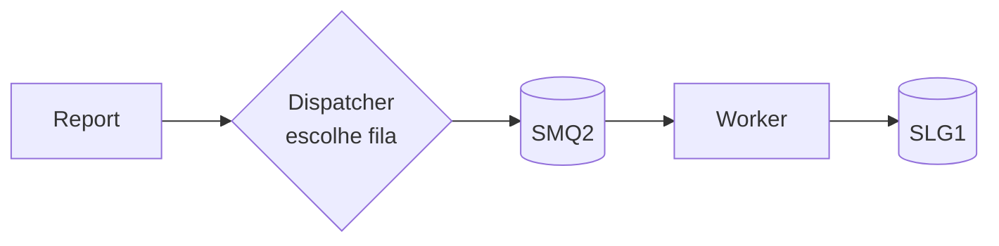
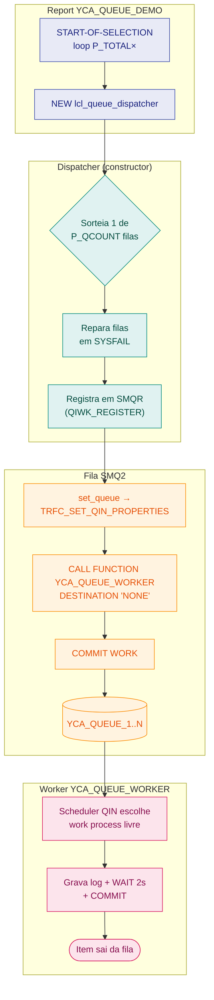

# Tutorial: distribuindo processamento em massa via fila SMQ1/SMQ2 (qRFC)

## Passo a passo resumido

*(pra quem conhece, isso aqui é o nosso "TL;DR" — sigla de internet que vem de "Too Long; Didn't Read")*

O que segue é o **MVP** do mecanismo: o mínimo necessário pra ver a
distribuição via qRFC funcionando de ponta a ponta, sem lógica de negócio
real (isso é o report/worker de demonstração, não uma solução pronta pra
produção).

```mermaid
%%{init: { 'flowchart': { 'curve': 'basis' } } }%%
flowchart LR
    R[Report] --> D{Dispatcher<br/>escolhe fila}
    D --> Q[(SMQ2)]
    Q --> W[Worker]
    W --> L[(SLG1)]
```

1. Crie um grupo de função e, dentro dele, o Function Module RFC-enabled a
   partir de [`files/YCA_QUEUE_WORKER.abap`](files/YCA_QUEUE_WORKER.abap).
2. Cadastre o objeto de log em SLG0 (`YCA_QUEUE` / `WORKER`).
3. Crie o report a partir de
   [`files/YCA_QUEUE_DEMO.abap`](files/YCA_QUEUE_DEMO.abap) — já inclui a
   classe dispatcher e a tela de seleção (`P_PREFIX`/`P_QCOUNT`/`P_EXEMOD`/`P_TOTAL`).
4. Rode e acompanhe em SMQ2/SLG1.

Autorizações necessárias em [Pré-requisitos](#pré-requisitos). Passo a passo
comentado (o porquê de cada decisão) a partir de
[Como vamos chegar lá](#como-vamos-chegar-lá).

---

## Glossário

| Termo | Significado |
|---|---|
| **qRFC** | Queued Remote Function Call — mecanismo do SAP para enfileirar chamadas RFC e processá-las de forma assíncrona e controlada |
| **RFC** | Remote Function Call — chamada de função habilitada para execução remota/assíncrona |
| **SMQ1** | Transação de monitoramento da fila *outbound* (saída) |
| **SMQ2** | Transação de monitoramento da fila *inbound* (entrada) — é a que este mecanismo usa |
| **SMQR** | Transação de registro de filas qRFC (define quem processa cada fila e em que modo) |
| **LUW** | Logical Unit of Work — tudo que roda entre dois `COMMIT WORK`, tratado como uma unidade só |
| **TRFCQIN** | Tabela padrão SAP com as entradas da fila inbound (SMQ2) |
| **SLG0 / SLG1** | Customizing (SLG0) e consulta (SLG1) do Application Log |
| **$TMP** | Pacote de objetos locais, sem transporte — existe só no mandante onde foi criado |
| **MVP** | Minimum Viable Product — aqui, a menor implementação que já prova o mecanismo funcionando ponta a ponta |

## Objetivo

Isso evita sobrecarregar o servidor com dezenas/centenas de jobs
concorrentes: quem decide quando e em qual work process cada item roda é o
próprio scheduler de qRFC do SAP (registrado em SMQR), não o programa
chamador.

O report tem uma tela de seleção (`P_PREFIX`, `P_QCOUNT`, `P_EXEMOD`,
`P_TOTAL`) — o padrão é **1 fila só**, mas dá pra testar com mais filas em
paralelo sem alterar código.

Solução isolada, criada do zero como exemplo/estudo, com nomes em inglês e
prefixo `YCA_` (fora do radar dos relatórios/transportes oficiais do
projeto).

## Pré-requisitos

- Acesso a **SE37**/**SE38** (ou ADT no Eclipse) para criar o grupo de
  função, o Function Module e o report.
- Autorização para criar objetos locais (`$TMP`), já que nada aqui é
  transportado.
- Autorização para manutenção em **SMQR** (registro de fila) e para
  visualizar **SMQ2** (monitoramento da fila inbound).
- Autorização em **SLG0** (customizing do objeto de log) e **SLG1**
  (consulta do Application Log).
- Testado num sistema S/4HANA (S4D); não há dependência de release
  específico além dos Function Modules padrão usados (`QIWK_*`,
  `TRFC_SET_QIN_PROPERTIES`, `/SDF/MON_CALC_QCOUNT`, `CF_RECA_MESSAGE_LIST`).

## Como vamos chegar lá

1. Entender o mecanismo (por que SMQ2 e não SMQ1)
2. Criar o Function Module worker (RFC) — o processamento em si
3. Cadastrar o objeto de log em SLG0 — pra provar que cada item rodou
4. Criar a classe dispatcher (local ao report, por ser um demo)
5. Criar o report de demonstração — o driver que dispara os itens
6. Testar e validar em SMQ2/SLG1

Todos os objetos ABAP foram criados em **`$TMP`** (objeto local, sem
transporte, existe só no mandante onde foram criados) no sistema S4D.

## O que precisa ser criado (checklist)

| # | Item | Criação | Fonte |
|---|---|---|---|
| 1 | Grupo de função `YCA_QUEUE_EXAMPLE` | Manual, container do FM — sem fonte próprio | — |
| 2 | Function Module `YCA_QUEUE_WORKER` (RFC) | Manual (Passo 2) | [`YCA_QUEUE_WORKER.abap`](files/YCA_QUEUE_WORKER.abap) |
| 3 | Application Log `YCA_QUEUE`/`WORKER` (SLG0) | Manual, customizing (Passo 3) | — |
| 4 | Classe `LCL_QUEUE_DISPATCHER` + report `YCA_QUEUE_DEMO` | Manual (Passos 4 e 5) | [`YCA_QUEUE_DEMO.abap`](files/YCA_QUEUE_DEMO.abap) |
| 5 | Fila SMQR (`YCA_QUEUE_1`..`N`, conforme `P_QCOUNT`) | **Não é manual** — registrada automaticamente em runtime | `QIWK_REGISTER`, chamado dentro do `CONSTRUCTOR` |

Sobre o item 5: a fila **ainda não existe** como objeto até este ponto do
tutorial. Não existe uma transação onde se "cria" uma fila SMQ2 antes do
tempo — o nome só passa a existir em SMQR/`TRFCQIN` na primeira vez que
`LCL_QUEUE_DISPATCHER` for instanciada com aquele nome, o que só acontece
quando `YCA_QUEUE_DEMO` rodar (Passo 6). Por isso os Passos 1 a 5 são todos
de preparação — a fila em si nasce sozinha no primeiro teste.

---

## Passo 1 — Entendendo o mecanismo: por que SMQ2 e não SMQ1

Antes de criar qualquer objeto, vale entender o que acontece quando o report
chama `CALL FUNCTION 'YCA_QUEUE_WORKER' IN BACKGROUND TASK DESTINATION 'NONE'
AS SEPARATE UNIT`:

```mermaid
%%{init: { 'flowchart': { 'curve': 'basis' } } }%%
flowchart TD
    subgraph REPORT["Report YCA_QUEUE_DEMO"]
        A["START-OF-SELECTION<br/>loop P_TOTAL×"] --> B["NEW lcl_queue_dispatcher"]
    end

    subgraph DISPATCHER["Dispatcher (constructor)"]
        B --> C{"Sorteia 1 de<br/>P_QCOUNT filas"}
        C --> D["Repara filas<br/>em SYSFAIL"]
        D --> E["Registra em SMQR<br/>(QIWK_REGISTER)"]
    end

    subgraph QUEUE["Fila SMQ2"]
        E --> F["set_queue →<br/>TRFC_SET_QIN_PROPERTIES"]
        F --> G["CALL FUNCTION YCA_QUEUE_WORKER<br/>DESTINATION 'NONE'"]
        G --> H["COMMIT WORK"]
        H --> I[("YCA_QUEUE_1..N")]
    end

    subgraph WORKER["Worker YCA_QUEUE_WORKER"]
        I --> J["Scheduler QIN escolhe<br/>work process livre"]
        J --> K["Grava log + WAIT 2s<br/>+ COMMIT"]
        K --> L(["Item sai da fila"])
    end

    classDef report fill:#e8eaf6,stroke:#3949ab,color:#1a237e
    classDef dispatcher fill:#e0f2f1,stroke:#00897b,color:#004d40
    classDef queue fill:#fff3e0,stroke:#fb8c00,color:#e65100
    classDef worker fill:#fce4ec,stroke:#d81b60,color:#880e4f

    class A,B report
    class C,D,E dispatcher
    class F,G,H,I queue
    class J,K,L worker
```

Duas peças do código de `LCL_QUEUE_DISPATCHER=>SET_QUEUE` explicam o destino:

1. **`DESTINATION 'NONE'`** significa "processar no próprio sistema". Não
   existe um salto real para um sistema remoto, então não existe uma fila de
   **saída** de verdade.
2. `SET_QUEUE` chama `TRFC_SET_QIN_PROPERTIES` (não `TRFC_SET_QUEUE_NAME`),
   porque `GV_REGISTERED` é sempre `ABAP_TRUE` nesta classe (o registro em
   SMQR acontece sempre no `CONSTRUCTOR`). `TRFC_SET_QIN_PROPERTIES` marca a
   **fila de entrada** (SMQ2 / tabela `TRFCQIN`) que vai receber a LUW atual
   assim que o `COMMIT WORK` acontecer. `TRFC_SET_QUEUE_NAME` (que gravaria
   em SMQ1 / `TRFCQOUT`) só faz sentido quando o destino é **remoto** — esse
   branch existe no código só como documentação do desenho original de duas
   filas, mas nunca é executado aqui (código morto, mantido de propósito).

Conclusão: com `DESTINATION 'NONE'` + fila sempre registrada, o item vai
**direto pra SMQ2**. O scheduler QIN (ativado via `QIWK_REGISTER`) é quem
decide em qual work process livre (dialog, já que `IV_EXEMODE = 'D'`) cada
fila roda — daí a ideia de "escolher o servidor mais livre, em teoria".

## Passo 2 — Criar o Function Module worker (RFC)

O worker é o **único objeto que precisa ser global** neste demo: um método
de classe não é RFC-habilitável, então `CALL FUNCTION ... IN BACKGROUND TASK`
exige um Function Module de verdade — e, por consequência, um grupo de
função como container. Não tem como fugir disso nem num demo.

1. Criar o grupo de função `YCA_QUEUE_EXAMPLE` (só o container, sem lógica):
   SE37 → menu **Function Module → Create... → Function Group → Create
   Group** (ou, pelo ADT, botão direito no pacote `$TMP` → **New → ABAP
   Function Group**).
2. SE37 (ou ADT) → criar Function Module `YCA_QUEUE_WORKER` dentro dele.
3. Na aba **Attributes**, campo **Processing Type**, marcar
   **"Remote-Enabled Module"** (RFC) — sem isso o qRFC/QIWK não consegue
   enfileirar a chamada, e `CALL FUNCTION ... IN BACKGROUND TASK` nem
   compila contra esse FM.
4. Parâmetros de um Function Module RFC só podem ser **passados por valor**
   (`VALUE(...)`) — é por isso que a assinatura é `VALUE(iv_guid) TYPE
   sysuuid_c32` e não passagem por referência (isso gerou um erro de
   ativação real durante a criação: *"In RFC modules, only parameters with
   pass by value are allowed"*).
5. O corpo do FM é onde entraria a lógica de negócio de verdade. Aqui, pro
   demo, ele só grava uma entrada no Application Log (Passo 3) e dá um
   `WAIT UP TO 2 SECONDS` — **não é parte da solução**, é só um artifício
   de demonstração: sem ele, o worker roda tão rápido que o item passa pela
   SMQ2 e some antes de você conseguir abrir a transação e ver alguma
   coisa. O `WAIT` segura a LUW "em execução" por 2 segundos, dando tempo de
   abrir a **SMQ2** e ver a(s) fila(s) (`YCA_QUEUE_1`..`N`, conforme
   `P_QCOUNT`) ocupada(s) ao mesmo tempo, com o restante dos itens esperando
   atrás — o efeito de **throttling** (nunca mais que `P_QCOUNT` em execução
   simultânea, mesmo com `P_TOTAL` na fila) fica visível. Numa solução real,
   essa linha deve ser removida.

Cole o conteúdo de [`YCA_QUEUE_WORKER.abap`](files/YCA_QUEUE_WORKER.abap) no
editor de fonte do FM e ative (`Ctrl+F3` ou botão **Activate**).

## Passo 3 — Cadastrar o objeto de log em SLG0

O objetivo do demo é só **provar que cada item foi processado** de forma
individual e rastreável, sem tocar em nenhuma tabela de negócio.
`CF_RECA_MESSAGE_LIST` (Application Log / SLG0) resolve isso bem porque:

- É um framework padrão do SAP, sem precisar criar tabela Z nenhuma;
- Cada execução do worker grava uma entrada com o `GUID` do item, o usuário e
  o timestamp — dá pra abrir **SLG1** depois e contar/conferir as entradas
  (uma por item, total = `P_TOTAL`);
- Zero impacto em dado de negócio — é só instrumentação do teste.

Esse cadastro é **customizing** (tabelas `BALOBJ`/`BALSUB`, mantidas via
`SM30`/`SLG0`), não é um objeto de repositório ABAP — por isso foi feito
**manualmente**, via transação SLG0:

- Object: `YCA_QUEUE` ("Queue demo")
- Sub-object: `WORKER` ("Worker")

Numa solução real, o `YCA_QUEUE_WORKER` faria o processamento de negócio de
fato (gravar um documento, chamar uma BAPI, etc.) e o log deixaria de ser o
propósito central — viraria só rastreabilidade/auditoria, como em qualquer
outro processo.

## Passo 4 — Criar a classe dispatcher (local ao report)

`LCL_QUEUE_DISPATCHER` foi mantida **local, dentro do report**
`YCA_QUEUE_DEMO` — de propósito. Isso é um **demo/exemplo de estudo**, não
uma solução produtiva, então o objetivo foi minimizar o número de artefatos
no sistema: uma classe global só se justificaria se essa lógica de fila
fosse reaproveitada por múltiplos reports/programas, o que não é o caso
aqui. Se um dia esse mecanismo virar solução real e mais de um processo
precisar dele, aí sim vale promover `LCL_QUEUE_DISPATCHER` para uma classe
global.

Responsabilidade da classe:

| Método | O que faz |
|---|---|
| `CONSTRUCTOR` | Escolhe/gera o nome da fila (sorteio entre N filas), recupera filas travadas em `SYSFAIL` (mata a LUW e reinicia), e registra a fila em SMQR (`QIWK_REGISTER`) |
| `SET_QUEUE` | Marca a LUW atual pra cair na fila certa (`TRFC_SET_QIN_PROPERTIES`, ver Passo 1) |
| `SET_DELAY` | Calcula o `QIN_COUNT` necessário pra só começar a processar depois de X segundos |
| `GET_QUEUE_NAME` / `SET_QUEUE_NAME` | Consulta/sobrescreve o nome da fila escolhido |

## Passo 5 — Criar o report de demonstração (driver + tela de seleção)

`YCA_QUEUE_DEMO` contém a classe do Passo 4 e, no `START-OF-SELECTION`, o
driver de teste: `P_TOTAL` iterações, cada uma reinstanciando o dispatcher
(que sorteia 1 de `P_QCOUNT` filas), registrando a fila se preciso, e
empilhando 1 item com um GUID novo via `YCA_QUEUE_WORKER`.

Em vez de valores fixos no código, o report tem uma tela de seleção
(`PARAMETERS`), o que o torna reutilizável pra outros testes sem precisar
editar o fonte:

| Parâmetro | Default | O que controla |
|---|---|---|
| `P_PREFIX` | `YCA_QUEUE_` | Prefixo do nome da fila |
| `P_QCOUNT` | `01` | Quantas filas paralelas distribuir (1 = sem paralelismo) |
| `P_EXEMOD` | `D` | Modo de execução no SMQR: `D` Dialog / `B` Batch |
| `P_TOTAL` | `20` | Quantos itens disparar no teste |

Por isso a lógica ficou em `START-OF-SELECTION` (roda depois que o usuário
preenche a tela) e não mais em `INITIALIZATION` (que só serviria pra montar
valores *default* antes da tela aparecer).

Cole o conteúdo de [`YCA_QUEUE_DEMO.abap`](files/YCA_QUEUE_DEMO.abap) no
editor de fonte do report (SE38) e ative (`Ctrl+F3` ou botão **Activate**).

## Passo 6 — Testar e validar

1. Confirmar que `YCA_QUEUE` / `WORKER` estão cadastrados em SLG0 (Passo 3).
2. Rodar `YCA_QUEUE_DEMO` via SE38/SA38, ajustando os parâmetros na tela de
   seleção se quiser (ex.: `P_QCOUNT = 5` pra testar múltiplas filas em
   paralelo).
3. Abrir **SMQ2** e observar a(s) fila(s) `YCA_QUEUE_1`..`N`
   enchendo/esvaziando em lotes (no máximo `P_QCOUNT` itens em execução
   simultânea, o resto esperando).
4. Abrir **SLG1**, objeto `YCA_QUEUE`, subobjeto `WORKER`, e conferir as
   `P_TOTAL` entradas (uma por GUID processado).

## Alternativa (opcional): pré-registrar a fila com wildcard no SMQR

Do jeito que está, o `CONSTRUCTOR` registra cada nome de fila
**individualmente** (`QIWK_CHECK_REGISTER` + `QIWK_REGISTER`) na primeira vez
que ele é gerado — com `P_QCOUNT = 5`, isso cria 5 registros distintos em
SMQR (`YCA_QUEUE_1` a `YCA_QUEUE_5`).

**SMQR aceita wildcard (`*`) no nome da fila.** Se você cadastrar manualmente
**um único registro** `YCA_QUEUE_*` (com o Exec. Mode desejado), esse
registro passa a cobrir **qualquer** nome de fila que comece com esse
prefixo — sem precisar de um registro por nome:

1. Transação `SMQR` → New Entries.
2. Queue Name: `YCA_QUEUE_*`.
3. Exec. Mode: `D` (Dialog) ou `B` (Batch) — deve bater com `P_EXEMOD`.
4. Salvar.

Com isso pré-cadastrado, `QIWK_CHECK_REGISTER` (dentro do `CONSTRUCTOR`) já
encontra qualquer nome gerado como registrado (via o match do wildcard), e o
`QIWK_REGISTER` dinâmico simplesmente nunca dispara. Vantagem: a
administração (Exec. Mode, etc.) fica centralizada num único registro em vez
de N. É totalmente **opcional** — o registro automático por nome exato que o
`CONSTRUCTOR` já faz continua funcionando normalmente sem esse cadastro
manual.

---

## Resumo dos artefatos

| Objeto | Tipo | Nome | Responsabilidade |
|---|---|---|---|
| Grupo de função | FUGR | `YCA_QUEUE_EXAMPLE` | Container obrigatório do Function Module |
| Function Module | FUNC (RFC-enabled) | `YCA_QUEUE_WORKER` | O "processamento" de fato — recebe um `GUID`, grava log, espera 2s (demo) |
| Program (report) | PROG | `YCA_QUEUE_DEMO` | Classe local `LCL_QUEUE_DISPATCHER` + driver de teste (`P_TOTAL` iterações, default 20) |
| Classe local | CLAS (local, dentro do report) | `LCL_QUEUE_DISPATCHER` | Lógica de fila: nome, distribuição, SMQR, SMQ2 |
| Objeto de log (customizing) | SLG0 | Object `YCA_QUEUE` / Subobject `WORKER` | Cadastro manual, necessário pro log do worker funcionar |

## Decisões tomadas nesta conversa

- **Namespace `Y` com prefixo `YCA_`**: fora do radar dos relatórios oficiais
  de GAP/transporte do projeto (é só um exemplo/estudo).
- **Objetos locais (`$TMP`)**: sem TR, sem aparecer em SCII — só existem no
  mandante onde foram criados.
- **`iv_execution_mode` parametrizado** no `CONSTRUCTOR` (default `'D'` =
  Dialog), em vez de fixo como no rascunho inicial.
- **Tela de seleção no report** (`P_PREFIX`/`P_QCOUNT`/`P_EXEMOD`/`P_TOTAL`),
  com `P_QCOUNT` default `01` — pro nosso exemplo, 1 fila já é suficiente;
  o paralelismo com mais filas fica disponível só se quiser testar.
- **Variáveis renomeadas pra inglês explícito** em toda a classe e no FM
  (`iv_guid`, `lo_message_list`, `lv_registration_status`, etc.) em vez dos
  nomes curtos/abreviados do rascunho original.
- **`COMMIT WORK AND WAIT`** no worker em vez de `CALL FUNCTION
  'BAPI_TRANSACTION_COMMIT'` — o `BAPI_TRANSACTION_COMMIT` é pensado pra ser
  chamado por quem consome uma BAPI de fora, não pra uso interno de um FM
  fazendo seu próprio commit.
- **Bug corrigido**: `QF05_RANDOM_INTEGER` exige o tipo exato `QF00-RAN_INT`
  no `RAN_INT_MAX`; um valor `NUMC2` direto causava
  `CX_SY_DYN_CALL_ILLEGAL_TYPE` (dump real durante o teste). Resolvido com
  uma variável intermediária no tipo certo.
- **Loop otimizado**: quando `iv_queue_suffix` é informado, o nome da fila
  não muda entre iterações, então o `CONSTRUCTOR` sai do loop na primeira
  volta em vez de repetir o mesmo `SELECT SINGLE` à toa.
