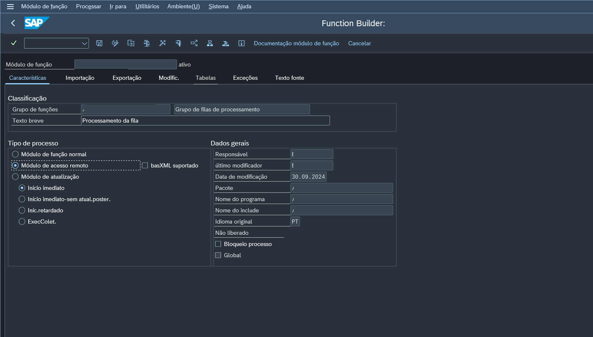

# Queue process
 Processamento de filas SMQ2.
 ~~no momento, eu penso que seja uma boa ideia fazer disso um post no SAP Blogs, mas isso vai por agua em alguns dias~~

 

> 🗘 Este documento, assim como o negócio, está em constante fase de melhoria e adaptação.

## Glossário

| Sigla | Significado | Descrição |
| :--- |:---------- |:---------- |
| BC |B usiness Consulting | ~~Find Clarity in Chaos~~ ABAP, Desenvolvedor SAP, Consultor ABAP, SAP DEV|
| FM | Function Module ||

## Fluxo da solução

### Processamento
Para o processamento de exemplo, vamos criar uma função que tera como unida função salvar um log de processamento. ~~isso basicamente diz: passou aqui!~~
A função tem de ser criada com *Tipo de processo: Módulo de acesso remoto*.

## Pontos de atenção 📝

- A chamada da função deve ser `IN BACKGROUND TASK DESTINATION 'NONE' AS SEPARATE UNIT`
- 
